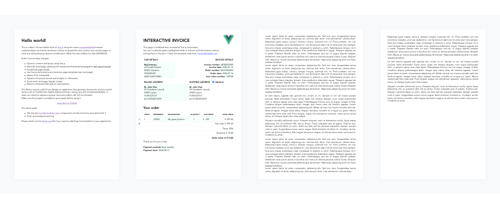

<div align="center">
  
</div>
<div align="center">
  
</div>

**vue-document-editor** is a rich-text editor built on top of [Vue.js](https://vuejs.org/), using the native [*contenteditable*](https://developer.mozilla.org/en-US/docs/Web/Guide/HTML/Editable_content) browser implementation and some JavaScript trickery to spread the content over paper-sized pages. It is mainly designed to allow **targeted modifications** to pre-formatted documents using HTML or **interactive templates**.

###### :speech_balloon: This package does not intend to replace a proper document editor with full functionality. If you're looking for a powerful word processor, check out [CKEditor for Vue.js](https://github.com/ckeditor/ckeditor5-vue).

## Features
### :rocket: [See live demo](https://motla.github.io/vue-document-editor)
- Use your Vue.js components as interactive page templates
- Word-by-word page splitting with forward and backward propagation (*still experimental*)
- Predefined page breaks
- Native Print compatible
- Dynamic document format and margins in millimeters
- Smart zoom and page display modes
- Computes text style at caret position
- Rewritten history stack (undo/redo) compatible with native commands

###### :speech_balloon: This package doesn't include any toolbar. The demo features [vue-file-toolbar-menu](https://github.com/motla/vue-file-toolbar-menu) for the toolbar.

## Installation
In your Vue.js project:

```
npm install vue-document-editor
```

###### :speech_balloon: You also need to install [`sass`](https://www.npmjs.com/package/sass) and [`sass-loader`](https://www.npmjs.com/package/sass-loader) if not already present in your project

###### :speech_balloon: If you prefer static files, import assets from the `dist` folder

## Basic example
###### MyComponent.vue
```Vue
<template>
  <div>
    <vue-document-editor :content.sync="content" />
  </div>
</template>

<script>
import VueDocumentEditor from 'vue-document-editor'

export default {
  components: { VueDocumentEditor },
  data () {
    return { 
      content: ["<h1>Hello!</h1>Fill this page with text and new pages will be created as it overflows."]
    }
  }
}
</script>

<style>
  body { font-family: Avenir, Helvetica, Arial, sans-serif; }
</style>
```

## Complete example
See the [Demo.vue](src/Demo/Demo.vue) file and the [InvoiceTemplate.vue](src/Demo.InvoiceTemplate.vue) file corresponding to the [live demo](https://motla.github.io/vue-document-editor).

## Props
- **content**: `Array` (required)

*Contains the initial document content. Each array item is a new set of pages containing the item. An item can either be an HTML string or this object `{ template: YourComponent, props: {} }` for interactive templates (see [Demo.vue](src/Demo/Demo.vue) and [InvoiceTemplate.vue](src/Demo.InvoiceTemplate.vue) for an example). If an HTML content is too large, it will be split over multiple pages. On the contrary, interactive templates take one full page and any overflow is hidden. The `content` you provide should be synced to user modifications using the [.sync modifier](https://vuejs.org/v2/guide/components-custom-events.html#sync-Modifier) (you have to enable .sync for undo/redo support).*

- **display**: `["auto"(default), "horizontal", "vertical"]` - *Display mode for the pages*
- **page_format_mm**: `[width, height] (default:[210, 297])` - *Page format in mm*
- **page_margins**: `String (default:"10mm 15mm")` - *Page margins in CSS format*
- **zoom**: `Number (default:1.0)`- *Display zoom. Only acts on the screen display*
- **editable**: `Boolean (default:true)` - *Used to disable document modification*

## Data
You can query data variables that contain the current state information about:
- **current_text_style**: [`CSSStyleDeclaration`](https://developer.mozilla.org/en-US/docs/Web/API/CSSStyleDeclaration)`| false` - *List of every CSS property at caret position, overloaded with these 3 properties:*
  - **textDecorationStack**: `Array` - *List of all text-decoration applied at caret position*
  - **headerLevel**: `Number` - *Maximum header level (`<h1>`, `<h2>`, ...) at caret position*
  - **isList**: `Boolean` - *If one parent has its `display` set to `list-item` at caret position*
- **can_undo**: `Boolean` - *If undo history is available*
- **can_redo**: `Boolean` - *If redo history is available*

In order to query this reactive data from a parent component, you can use a [`ref`](https://vuejs.org/v2/api/#ref) to the `vue-document-editor` instance and call `this.$refs.editor.xxx` after the component is mounted. See [Demo.vue](src/Demo/Demo.vue) for an example.

## Styling
You can override these CSS variables somewhere in your project (it will not affect the print):
```css
:root {
  --page-background: unset; /* Pages background */
  --page-box-shadow: unset; /* Pages box-shadow */
  --page-border: unset; /* Pages border */
  --page-border-radius: unset; /* Pages border-radius */
}
```
The default font style of the document is set by the parent element.

###### :speech_balloon: If you need some variables that are missing, edit [the stylesheet](src/DocumentEditor/imports/doc-editor-default-styles.scss) then submit a PR, or overwrite styles using `!important`

## Known issues / limitations
- **Performance**: Large texts must be divided into multiple paragraphs and large page numbers can slow down the entire document.
- **Safari print**: Safari adds print margins unless you choose a borderless paper format in the print box. This has to be done manually. I guess there is no workaround for this issue yet.
- **Tables, images**: User cannot resize tables nor images yet. However, table rows split fine over multiple pages.

## Project development
- `npm run serve` compiles and hot-reloads demo for development
- `npm run lint` lints and fixes files
- `npm run build` compiles and minifies production files and demo

## Licensing
Copyright (c) 2020 Romain Lamothe, [MIT License](LICENSE)